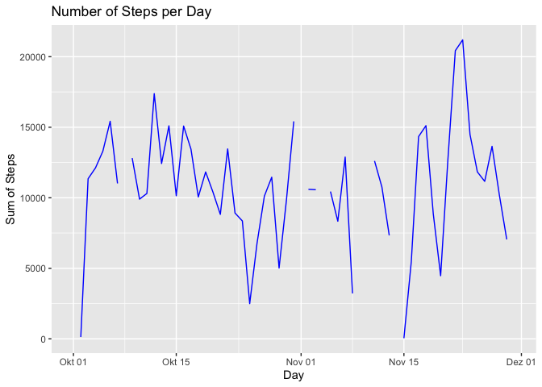
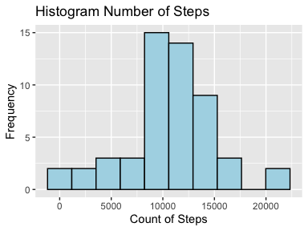
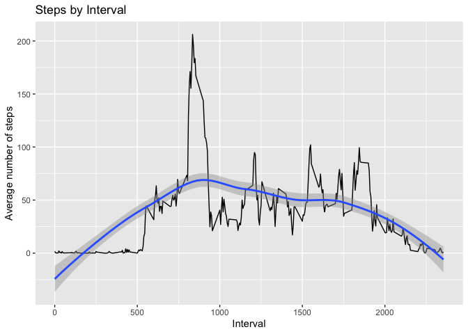
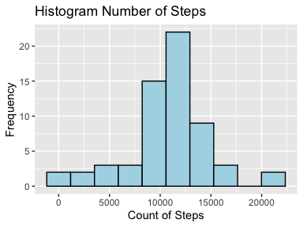
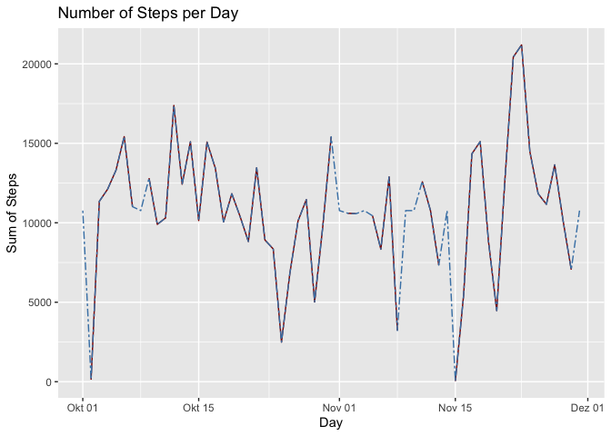
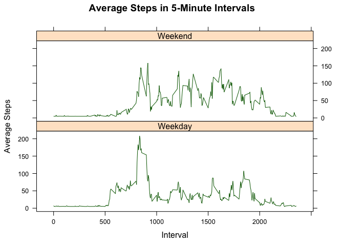

## Loading and preprocessing the data

```r
library(dplyr)
library(ggplot2)
library(lattice)
library(lubridate)
```


```r
data <- read.csv(unzip("activity.zip"))
sum_steps <- data %>% group_by(date) %>% summarize(sum=sum(steps) )
```

## What is mean total number of steps taken per day?
#Total number of steps per day

```r
ggplot(sum_steps, aes(as.Date(date), sum, na.rm=T)) +
        geom_line(col="blue")+
        labs(x="Day", y="Sum of Steps", title="Number of Steps per Day")
```

<!-- -->

#Histogram of the number of steps

```r
plot <- ggplot(sum_steps, aes(sum), na.rm=T)+
        geom_histogram(bins=10, col="black", fill="lightblue")+
        labs(x="Count of Steps", y="Frequency", title="Histogram Number of Steps")
```

```r
plot
```

<!-- -->


#Mean and Median of the number of steps per day 

```r
avg <- mean(sum_steps$sum, na.rm=T)
med <- median(sum_steps$sum, na.rm=T)
```
The median is 10765 and the mean is 1.0766189\times 10^{4}


## What is the average daily activity pattern?


```r
d_interval <- data %>% filter(steps != "NA") %>% group_by(interval) %>% summarize(avg=mean(steps) )
qplot(data=d_interval, x=interval, y=avg
      ,xlab="Interval"
      ,ylab="Average number of steps"
      ,main="Steps by Interval"
      ,geom=c("line", "smooth")
      )
```

```
## `geom_smooth()` using method = 'loess' and formula 'y ~ x'
```

<!-- -->

```r
max_i <- d_interval[d_interval$avg==max(d_interval$avg),]$interval
```
The interval # 835 is the interval with the biggest average number of steps


## Imputing missing values
#Total number of missing values in the dataset

```r
incomplete_cases <- !complete.cases(data)
sum(incomplete_cases)
```

```
## [1] 2304
```
There are 2304 incomplete cases in the dataset

# Strategy for filling missing data 
We use the overall mean of the steps/interval to fill the gaps
We create a new data set data_complete with the gaps filled

```r
# use the logical vector(incomplete_cases)
avg_steps <-  mean(data$steps, na.rm=TRUE)
data_complete <- data
data_complete[incomplete_cases == TRUE,]$steps <- avg_steps 
```

Histogram of the new dataset

```r
sum_steps2 <- data_complete %>% group_by(date) %>% summarize(sum=sum(steps) )
plot <- ggplot(sum_steps2, aes(sum), na.rm=T)+
        geom_histogram(bins=10, col="black", fill="lightblue")+
        labs(x="Count of Steps", y="Frequency", title="Histogram Number of Steps")
```
<!-- -->

```r
avg2 <- mean(sum_steps2$sum, na.rm=T)
med2 <- median(sum_steps2$sum, na.rm=T)
delta_avg= avg2-avg
delta_median = med2-med
impact = avg2/avg-1
```
The new median is 1.0766189\times 10^{4} and the new mean is 1.0766189\times 10^{4}
The median delta is 1.1886792 and the mean delta is 0

The impact on the average daily number of steps is 0 %

Additionally we plot the daily number of steps in th two scenarios

```r
sum_steps$sum2 <- sum_steps2$sum
ggplot(sum_steps, aes(x=as.Date(date), na.rm=T)) +
        geom_line(aes(y=sum), col="darkred")+
        geom_line(aes(y=sum2), col="steelblue", linetype="twodash")+
        labs(x="Day", y="Sum of Steps", title="Number of Steps per Day")
```

```
## Warning: Removed 2 row(s) containing missing values (geom_path).
```

<!-- -->

## Are there differences in activity patterns between weekdays and weekends?

```r
data_complete$days <- wday(as.Date(data_complete$date), label=TRUE, week_start=1, locale="en_US") # add T/F if day is a weekend
weekend  <- c("Sat", "Sun")
data_complete$weekend <- data_complete$days %in% weekend
data_complete$weekend[data_complete$weekend == "TRUE" ] <- "Weekend"
data_complete$weekend[data_complete$weekend == "FALSE" ] <- "Weekday"
data_avg <- data_complete %>% group_by(interval, weekend) %>%
        summarize(avg_steps = mean(steps))

xyplot(avg_steps ~ interval | weekend
       ,data= data_avg
       ,layout=c(1,2)
       ,type = "l"
       ,xlab= "Interval"
       ,ylab = "Average Steps"
       ,col="darkgreen"
       ,main= "Average Steps in 5-Minute Intervals")
```

<!-- -->


